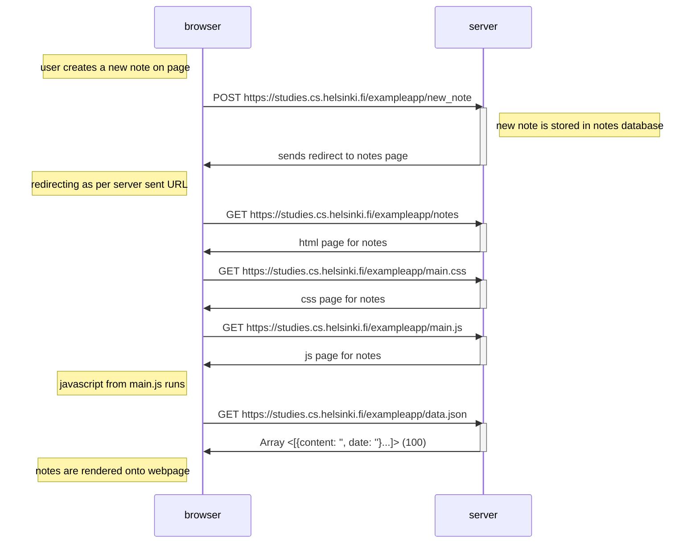

```mermaid
sequenceDiagram
	participant browser
	participant server
	
	note left of browser: user creates a new note on page
	browser->>server: POST https://studies.cs.helsinki.fi/exampleapp/new_note
	activate server
	note right of server: new note is stored in notes database
	server->>browser: sends redirect to notes page
	deactivate server
	
	note left of browser: redirecting as per server sent URL
	browser->>server: GET https://studies.cs.helsinki.fi/exampleapp/notes
	activate server
	server->>browser: html page for notes
	deactivate server
	browser->>server: GET https://studies.cs.helsinki.fi/exampleapp/main.css
	activate server
	server->>browser: css page for notes
	deactivate server
	browser->>server: GET https://studies.cs.helsinki.fi/exampleapp/main.js
	activate server
	server->>browser: js page for notes
	deactivate server
	
	note left of browser: javascript from main.js runs
	browser->>server: GET https://studies.cs.helsinki.fi/exampleapp/data.json
	activate server
	server->>browser: Array <[{content: '', date: ''}...]> (100)
	deactivate server
	
	note left of browser: notes are rendered onto webpage
```