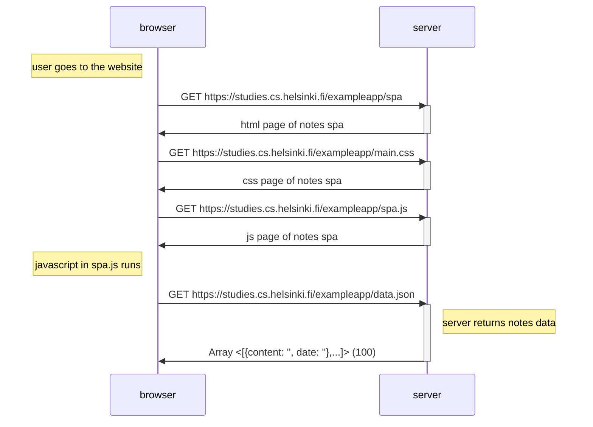

```mermaid
sequenceDiagram
	participant browser
	participant server
	
	note left of browser: user goes to the website
	browser->>server: GET https://studies.cs.helsinki.fi/exampleapp/spa
	activate server
	server->>browser: html page of notes spa
	deactivate server
	browser->>server: GET https://studies.cs.helsinki.fi/exampleapp/main.css
	activate server
	server->>browser: css page of notes spa
	deactivate server
	browser->>server: GET https://studies.cs.helsinki.fi/exampleapp/spa.js
	activate server
	server->>browser: js page of notes spa
	deactivate server
	
	note left of browser: javascript in spa.js runs
	browser->>server: GET https://studies.cs.helsinki.fi/exampleapp/data.json
	activate server
	note right of server: server returns notes data
	server->>browser: Array <[{content: '', date: ''},...]> (100)
	deactivate server
```