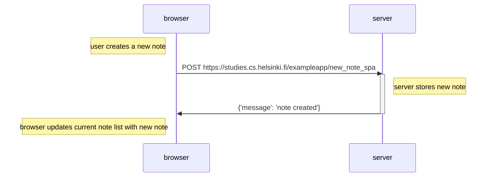

```mermaid
sequenceDiagram
	note left of browser: user creates a new note
	browser->>server: POST https://studies.cs.helsinki.fi/exampleapp/new_note_spa
	activate server
	note right of server: server stores new note
	server->>browser: {'message': 'note created'}
	deactivate server
	note left of browser: browser updates current note list with new note
```